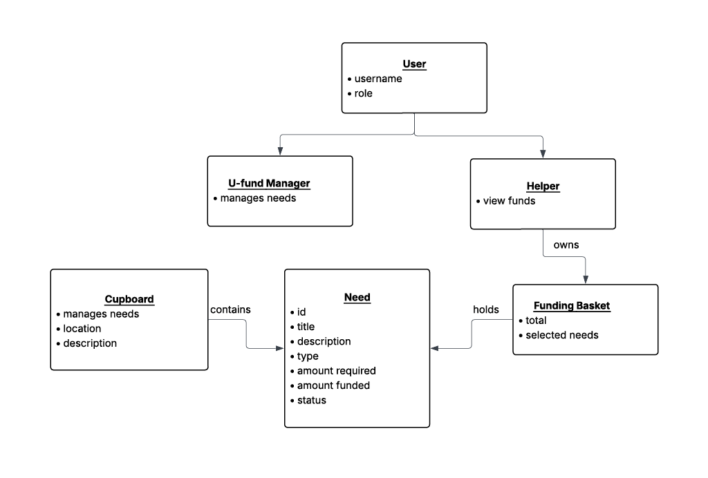
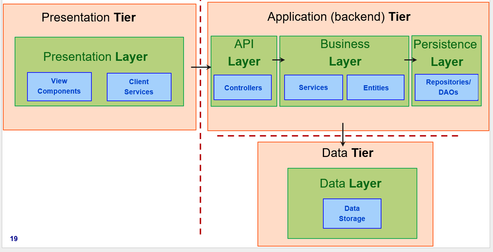
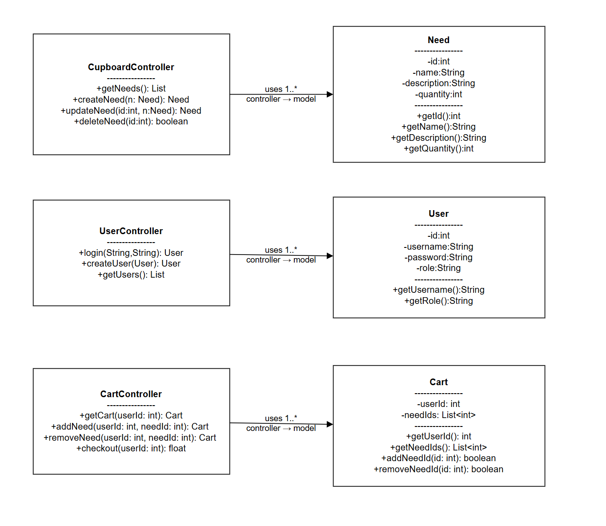
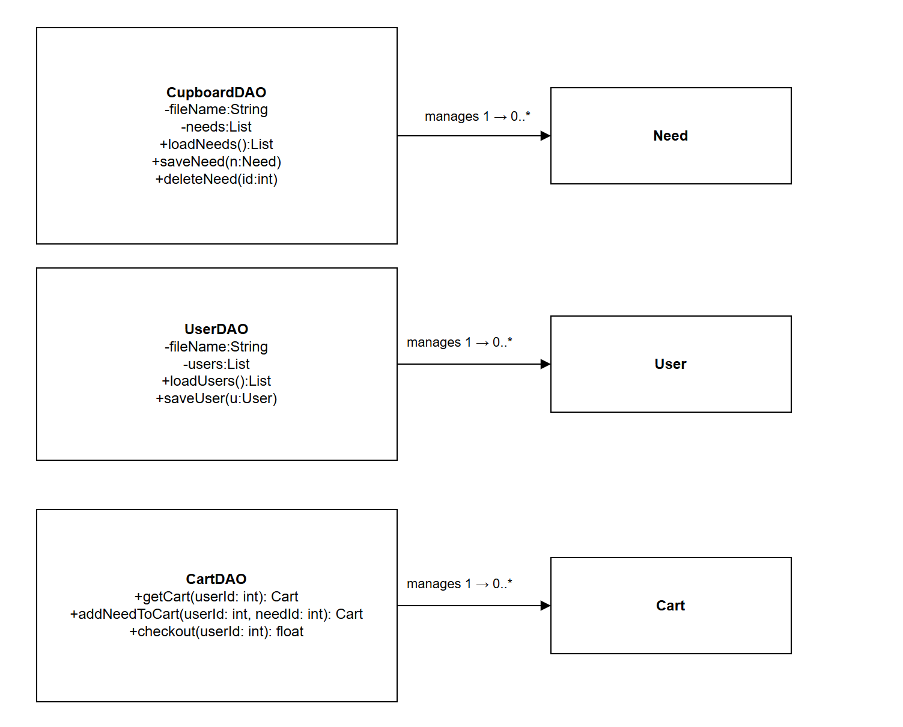

---
geometry: margin=1in
---
# PROJECT Design Documentation

> _The following template provides the headings for your Design
> Documentation.  As you edit each section make sure you remove these
> commentary 'blockquotes'; the lines that start with a > character
> and appear in the generated PDF in italics but do so only **after** all team members agree that the requirements for that section and current Sprint have been met. **Do not** delete future Sprint expectations._

## Team Information
* Team name: Cookie Run
* Team members
  * Gabriel MonteLeon
  * Amanda Guan
  * Mia Venesky
  * Alexandra Jean

## Executive Summary

This is a summary of the project.

### Purpose
>  _**[Sprint 2 & 4]** Provide a very brief statement about the project and the most
> important user group and user goals._

We plan on making a cat adoption service where the most important users are the managers and supporters and their abilities to view and access needs are the most important goals.
### Glossary and Acronyms
> _**[Sprint 2 & 4]** Provide a table of terms and acronyms._

| Term | Definition |
|------|------------|
| SPA | Single Page |

## Requirements

This section describes the features of the application.

> _In this section you do not need to be exhaustive and list every
> story.  Focus on top-level features from the Vision document and
> maybe Epics and critical Stories._

### Definition of MVP
> _**[Sprint 2 & 4]** Provide a simple description of the Minimum Viable Product._
> We plan on having a website where you can create edit and view needs as a manager as well as view and support needs as a helper. We plan to also have a log in system for our MVP.

### MVP Features
>  _**[Sprint 4]** Provide a list of top-level Epics and/or Stories of the MVP._

### Enhancements
> _**[Sprint 4]** Describe what enhancements you have implemented for the project._

## Application Domain

This section describes the application domain.

> _**[Sprint 2 & 4]** Provide a high-level overview of the domain for this application. You
> can discuss the more important domain entities and their relationship
> to each other._

## Architecture and Design

This section describes the application architecture.

### Summary

The following Tiers/Layers diagram shows a high-level view of the webapp's architecture. 
**NOTE**: detailed diagrams are required in later sections of this document.

The web application is built using the **Presentation**(frontend), **Application**(backend), **Data** tiered architecture. 

The Presentation (frontend) is a client‑side SPA built with Angular, using HTML, CSS, and TypeScript to deliver the user interface and handle all user interactions.

The Application (backend) tier exposes RESTful APIs, implements business logic, and uses repositories/DAOs to interact with the underlying Data tier for persistence.

The Data contains the mechanisms responsible for storing, retrieving, and managing the application’s data using low‑level storage systems.

Both the Application and Data tiers are implemented using Java and the Spring Framework, with details of their internal components provided below.

### Overview of User Interface

This section describes the web interface and flow; this is how the user views and interacts with the web application.

### 
> _Provide a summary of the application's user interface.  Describe, from the user's perspective, the flow of the pages/navigation in the web application.
>  (Add low-fidelity mockups prior to initiating your **[Sprint 2]**  work so you have a good idea of the user interactions.) Eventually replace with representative screenshots of your high-fidelity results as these become available and finally include future recommendations improvement recommendations for your **[Sprint 4]** )_

### Presentation Tier
> _**[Sprint 4]** Provide a summary of the Presentation Tier UI of your architecture.
> Describe the types of components in the tier and describe their
> responsibilities.  This should be a narrative description, i.e. it has
> a flow or "story line" that the reader can follow._

> _**[Sprint 4]** You must  provide at least **2 sequence diagrams** as is relevant to a particular aspects 
> of the design that you are describing.  (**For example**, in a shopping experience application you might create a 
> sequence diagram of a customer searching for an item and adding to their cart.)
> As these can span multiple tiers, be sure to include the round-trip, starting at an HTTP request from the client-side (frontend), covering steps through the server-side (backend) and reaching data storage
> to help illustrate the end-to-end flow._

> _**[Sprint 4]** To effectively illustrate the system, you should include static **class diagrams**  where they are relevant to your design. Some additional guidance is provided below:_
 >* _Class diagrams apply to the **Application** tier and more specifically within its relevant **Layers**._
>* _A single class diagram of the entire system will not be effective. You may start with one, but will need to break it down into smaller sections to account for requirements of each of the Layer's static models below._
 >* _Correct labeling of relationships with proper notation for the relationship type, multiplicities, and navigation information will be important._
 >* _Include other details such as attributes and method signatures that you think are needed to support the level of detail in your discussion._

### Application Tier
> _**[Sprint 4]** Provide a summary of this tier of your architecture. This
> section will follow the same instructions that are given for the Presentation
> Tier above._
> 
#### API Layer
> _**[Sprint 1, 4]** Provide a summary of this architectural layer._

> API Layer will control the info for the needs and users handling searching and creation of both needs and users.

> Cupboard Controller: Controls needs
> User Controller: Controls users
> Need: Gives the definition of a need
> User: Gives the definition of a user
> _At appropriate places as part of this narrative provide **one** or more updated and **properly labeled**
> static models (UML class diagrams) with some details such as associations (connections) between classes, and critical attributes and methods. (**Be sure** to revisit the Static **UML Review Sheet** to ensure your class diagrams are using correct format and syntax.)_
> 

#### Business Layer
> _**[Sprint 1, 4]** Provide a summary of this architectural layer._

> We plan to make two different versions of the software to be viewed from Helpers and Managers and will need the Business layer to handle the logic for both types.

CupboardController: finds needs in various methods.
UserController: Can check passwords for logging in.
> _At appropriate places as part of this narrative provide **one** or more updated and **properly labeled**
> static models (UML class diagrams) with some details such as associations (connections) between classes, and critical attributes and methods. (**Be sure** to revisit the Static **UML Review Sheet** to ensure your class diagrams are using correct format and syntax.)_
> 

#### Persistence Layer
> _**[Sprint 1, 4]** Provide a summary of this architectural layer._

> We are using json files under the data folder and loading them as the project starts running and have several classes to update the json to store the data. 

CupboardDAO: Updates the cupboard.json file with needs
UserFileDAO: Updates the users.json file with users
CartFileDAO: Updates the carts.json file with the carts of every user

> _At appropriate places as part of this narrative provide **one** or more updated and **properly labeled**
> static models (UML class diagrams) with some details such as associations (connections) between classes, and critical attributes and methods. (**Be sure** to revisit the Static **UML Review Sheet** to ensure your class diagrams are using correct format and syntax.)_
> 

### Data Tier
> _**[Sprint 1, 4]** Provide a summary of this tier of your architecture. This
> section will follow the same instructions that are given for the Presentation
> Tier above._

> We are storing our data in json files under the data folder and loading them as the project starts running. 
## OO Design Principles

1. Abstraction
NeedDAO, UserDAO, and CartDAO are interfaces that define contracts for persistence operations without exposing implementation details. CupboardDAO implements NeedDAO, UserFileDAO implements UserDAO, and CartFileDAO implements CartDAO. Controllers depend on these interfaces, so the storage mechanism could be swapped without changing controller code.
2. Encapsulation
Model classes (Need, User, Cart) keep their fields private and expose only getter methods (and targeted setters where needed). Internal state of DAO classes — the HashMap, nextId counter, and filePath — are all private. The load() and save() methods are private to the DAO, so callers can only interact through the public interface methods.
3. Single Responsibility
Each class has one clear job: controllers handle HTTP request/response mapping, DAOs handle data storage and retrieval, model classes hold data, and Angular components handle their specific UI view. The CartFileDAO's checkout method is the one place that owns the checkout business logic (decrement, delete, total), keeping that logic out of the controller.
4. Dependency Injection
Spring's IoC container injects DAO dependencies into controllers at runtime. CartFileDAO receives a NeedDAO reference via constructor injection, allowing it to look up and modify needs during checkout without owning the NeedDAO lifecycle. This decouples the cart logic from the specific need storage implementation.

## Static Code Analysis/Future Design Improvements
> _**[Sprint 4]** With the results from the Static Code Analysis exercise, 
> **Identify 3-4** areas within your code that have been flagged by the Static Code 
> Analysis Tool (SonarQube) and provide your analysis and recommendations.  
> Include any relevant screenshot(s) with each area._

> _**[Sprint 4]** Discuss **future** refactoring and other design improvements your team would explore if the team had additional time._

## Testing
> _This section will provide information about the testing performed
> and the results of the testing._

### Acceptance Testing
> _**[Sprint 2 & 4]** Report on the number of user stories that have passed all their
> acceptance criteria tests, the number that have some acceptance
> criteria tests failing, and the number of user stories that
> have not had any testing yet. Highlight the issues found during
> acceptance testing and if there are any concerns._

Sprint 2: So far most user stories have been completed though we need to finish working on the security aspect for our users as there are serious flaws.
### Unit Testing and Code Coverage
> _**[Sprint 4]** Discuss your unit testing strategy. Report on the code coverage
> achieved from unit testing of the code base. Discuss the team's
> coverage targets, why you selected those values, and how well your
> code coverage met your targets._

>_**[Sprint 2, 3 & 4]** **Include images of your code coverage report.** If there are any anomalies, discuss
> those._

## Ongoing Rationale
>_**[Sprint 1, 2, 3 & 4]** Throughout the project, provide a time stamp **(yyyy/mm/dd): Sprint # and description** of any _**mayor**_ team decisions or design milestones/changes and corresponding justification._

N/A